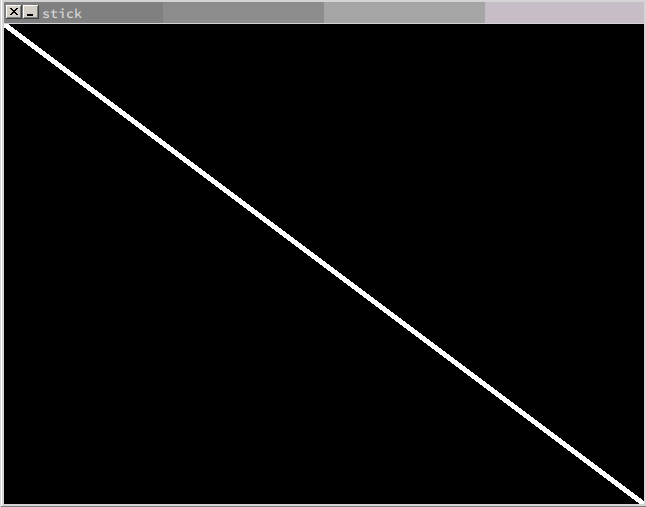

# Stick
A stick game written in C with Allegro5

# Build
To build, simply type:
```
. build
```

# Screenshots


# Objective
Move the stick shown in white above, and capture the red enemies (not on the picture for some reason).

# THIS PROJECT IS DISCONTINUED
This means I will not fix any problems in this game.
